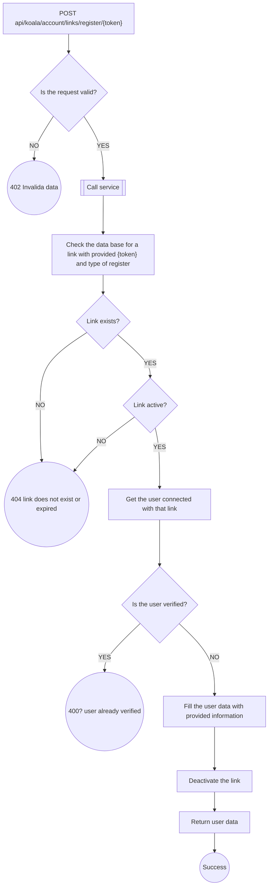
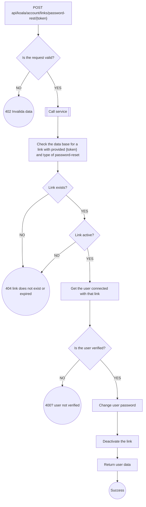
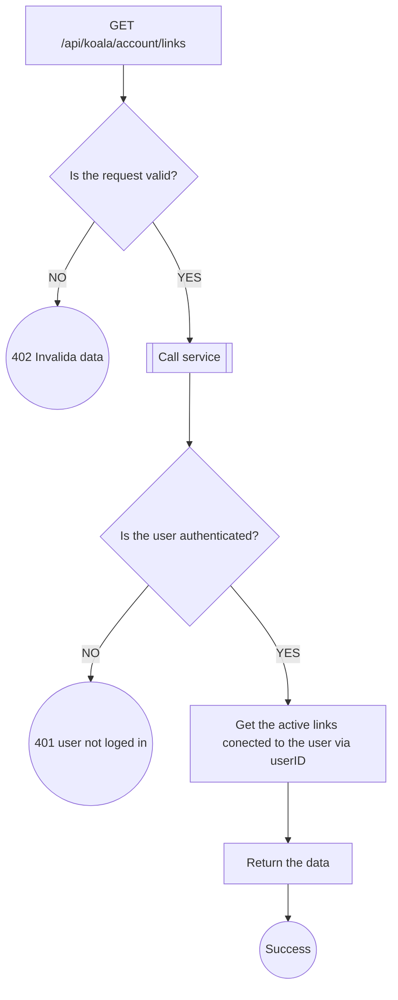
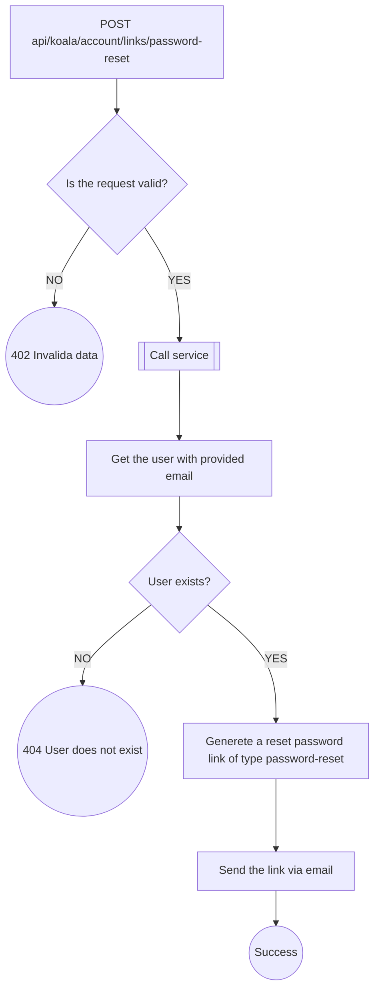
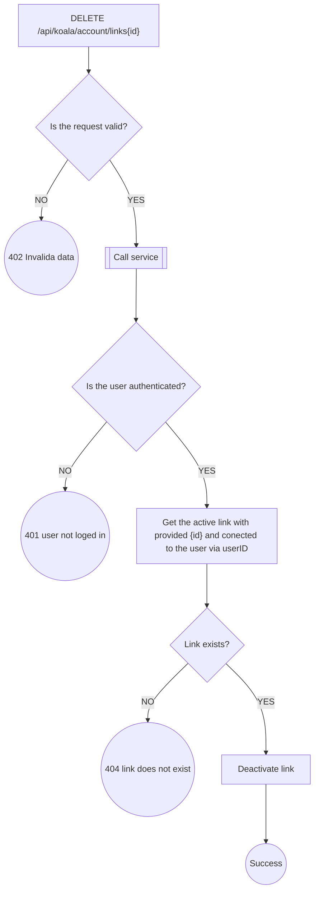
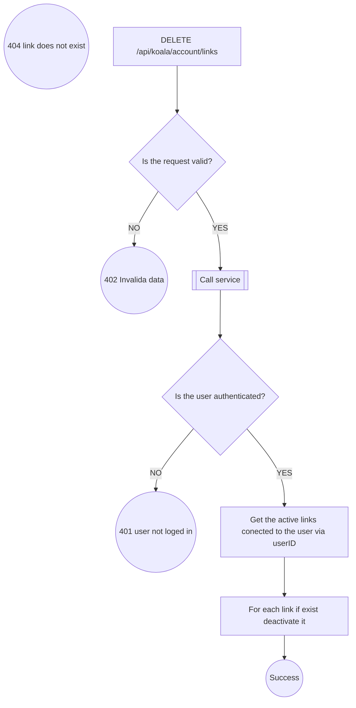

# Link Endpoints
---

## `POST api/koala/account/links/register/{token}`

---

## `POST api/koala/account/links/password-rest/{token}`

---

## `GET api/koala/account/links`

---

## `POST api/koala/account/links/password-reset`

---

## `DELETE api/koala/account/links/{id}`

---

## `DELETE api/koala/account/links`

---