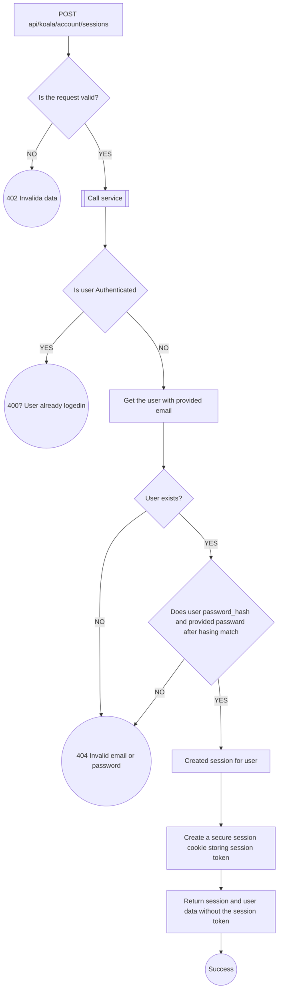
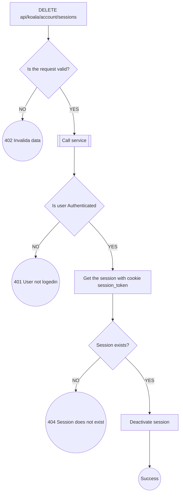
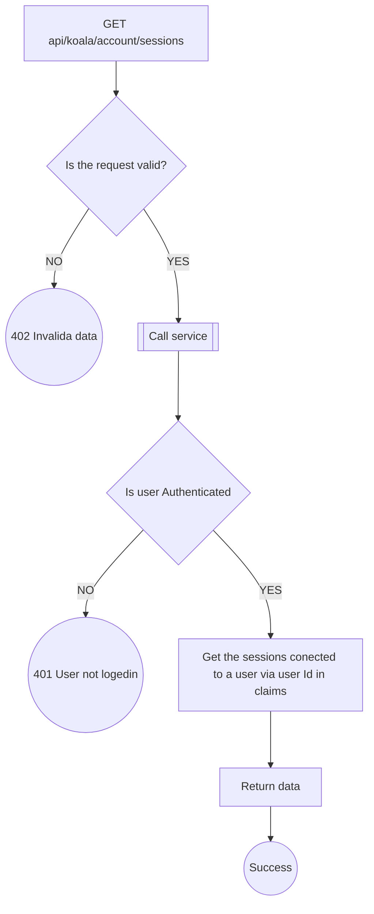
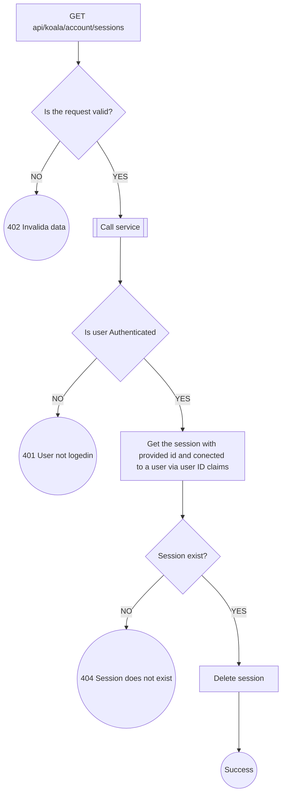
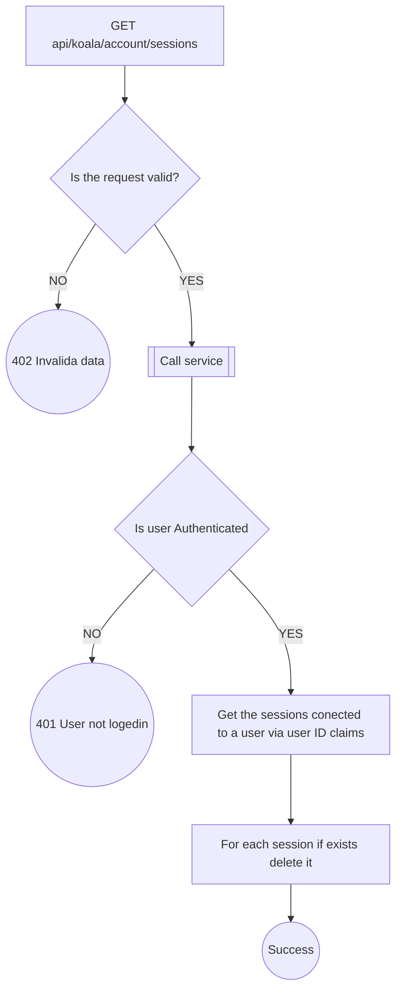

# Session Endpoints

---
## `POST api/koala/account/sessions`

---
## `DELETE api/koala/account/sessions`

---
## `GET api/koala/account/sessions`

---
## `DELETE api/koala/account/sessions/{id}`

---

## `DELETE api/koala/account/sessions/all`

---