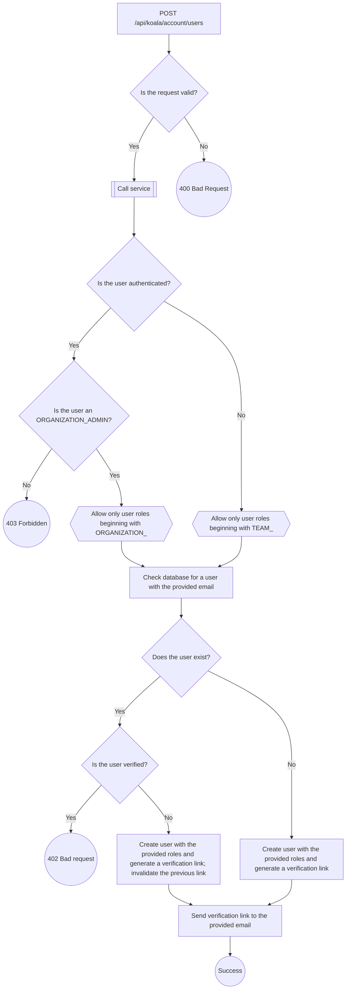
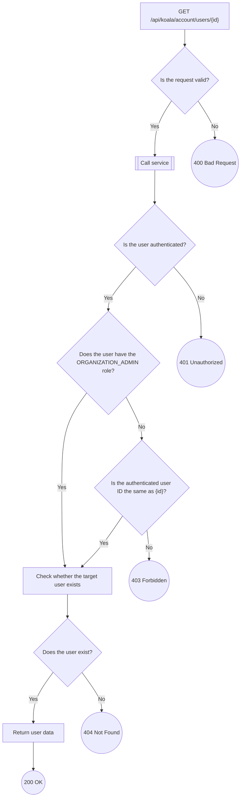
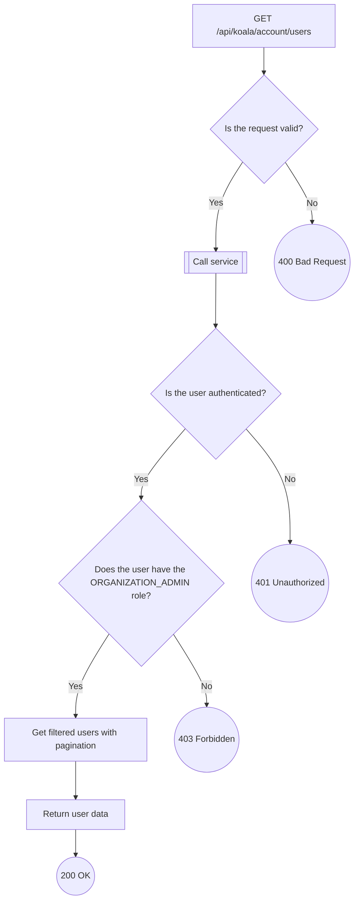
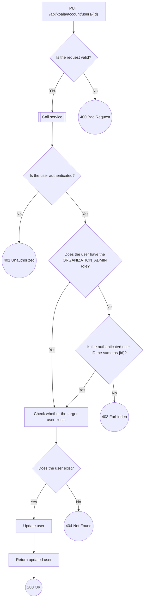
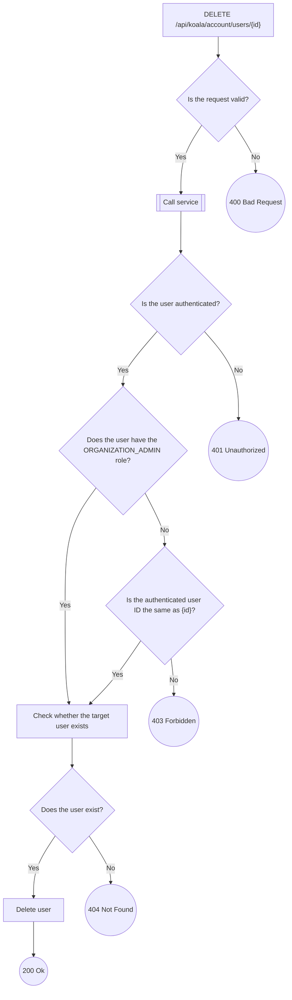

# User Endpoints
---

## `POST api/koala/account/users`

---

## `GET api/koala/account/users{id}`

---

## `GET api/koala/account/users`

---

## `PUT api/koala/account/users{id}`

---

## `DELETE api/koala/account/users{id}`

---