# Scenariusze i ścieżki użytkownika

Poniższe 11 ścieżek przedstawia szczegółowe instrukcje obsługi panelu administracyjnego dla Adminów / Edytorów / Recenzentów KOALIcji

## Logowanie, wylogowanie i edycja hasła

### Cel : Zalogowanie siebie jako użytkownika

**_Warunki wstępne:_**

- Użytkownik znajduje się na stronie logowania panelu administracyjnego konkursu (/admin/login).

**_Przebieg:_**

1. Uzupełnienie prawidłowymi danymi pól opisanych "Email" oraz "Hasło".
2. Naciśnięcie przycisku "Zaloguj".

**_Rezultat:_** Przekierowanie zalogowanego użytkownika na panel startowy (/admin).

**_Scenariusze alternatywne:_**

**A1. Nieprawidłowy adres e-mail lub hasło**

1. Użytkownik wprowadza nieprawidłowy adres e-mail lub hasło.
2. Użytkownik naciska przycisk „Zaloguj”.
3. System wyświetla komunikat o błędnych danych logowania.
4. Użytkownik pozostaje na stronie logowania.

_Rezultat:_ Logowanie nie zostaje wykonane.

**A2. Niewypełnienie wymaganych pól**

1. Użytkownik pozostawia puste pole „Email” lub „Hasło”.
2. Użytkownik naciska przycisk „Zaloguj”.
3. System wyświetla komunikat walidacyjny informujący o konieczności uzupełnienia wymaganych pól.

_Rezultat:_ Formularz nie zostaje wysłany.

---

### Cel : Zmiana hasła swojego użytkownika

**_Warunki wstępne:_**

- Użytkownik jest zalogowany do systemu.
- Użytkownik posiada aktywne konto.

**_Przebieg:_**

1. Wybranie ikony Koali w prawym górnym rogu.
2. Wybranie opcji „Zmień hasło”.
3. Wprowadzenie aktualnego hasła.
4. Wprowadzenie nowego hasła.
5. Naciśnięcie przycisku „Potwierdź zmianę hasła”.

**_Rezultat:_** Hasło użytkownika zostaje zmienione.

**_Scenariusze alternatywne:_**

**A1. Niepoprawne aktualne hasło**

1. Użytkownik podaje błędne aktualne hasło.
2. System wyświetla komunikat o błędnym haśle.

_Rezultat:_ Hasło nie zostaje zmienione.

---

### Cel : Wylogowanie

**_Warunki wstępne:_**

- Użytkownik jest zalogowany do systemu.
- Użytkownik posiada aktywne konto.

**_Przebieg:_**

1. Wybranie ikony Koali w prawym górnym rogu.
2. Wybranie opcji „Logout”.

**_Rezultat:_**

- Sesja użytkownika zostaje zakończona.
- System przekierowuje użytkownika na stronę logowania.

---

## Użytkownicy

### Cel : Dodanie nowego użytkownika przez administratora

**_Warunki wstępne:_**

- Administrator jest zalogowany do systemu.
- Administrator posiada uprawnienia do zarządzania użytkownikami.
- Administrator znajduje się w panelu głównym (/admin).

**_Przebieg:_**

1. Naciśnięcie przycisku „Dodaj użytkownika”.
2. Uzupełnienie wymaganych danych użytkownika.
3. Naciśnięcie przycisku „Dodaj użytkownika”.
4. System tworzy nowe konto użytkownika.

**_Rezultat:_**

- Nowy użytkownik zostaje zapisany w systemie.
- Użytkownik pojawia się na liście użytkowników.

**_Scenariusze alternatywne:_**

**A1. Adres e-mail jest już zajęty**

1. Administrator podaje adres e-mail istniejący w systemie.
2. System wyświetla komunikat o zajętym adresie e-mail.

_Rezultat:_ Konto nie zostaje utworzone.

**A2. Nieuzupełnienie wymaganych pól**

1. Administrator pozostawia jedno lub więcej wymaganych pól pustych.
2. System wyświetla komunikaty walidacyjne.

_Rezultat:_ Konto nie zostaje utworzone.

---

### Cel : Zmiana roli użytkownika w systemie przez administratora

**_Warunki wstępne:_**

- Administrator jest zalogowany do systemu.
- Administrator posiada uprawnienia do zarządzania użytkownikami.
- Administrator znajduje się w panelu głównym (/admin).

**_Przebieg:_**

1. Naciśniecie przycisku edycji .
2. Zmiana roli poprzez zaznaczenie odpowiednich checkboxów.
3. Naciśnięcie przycisku „Zapisz”.

**_Rezultat:_**

- Rola użytkownika zostaje zmieniona.
- Użytkownik uzyskuje uprawnienia wynikające z nowej roli.

**_Scenariusze alternatywne:_**

**A1. Anulowanie operacji**

1. Administrator wybiera opcję „Anuluj”.

_Rezultat:_ Rola użytkownika pozostaje bez zmian.

---

### Cel : Usunięcie użytkownika z systemu przez administratora

**_Warunki wstępne:_**

- Administrator jest zalogowany do systemu.
- Administrator posiada uprawnienia do zarządzania użytkownikami.
- Administrator znajduje się w panelu głównym (/admin).

**_Przebieg:_**

1. Naciśniecie przycisku usunięcia .
2. Potwierdzenie ok w alercie.

**_Rezultat:_**

- Konto użytkownika zostaje usunięte.
- Użytkownik nie może zalogować się do systemu.

**_Scenariusze alternatywne:_**

**A1. Anulowanie usunięcia**

1. Administrator wybiera opcję „Anuluj” w oknie potwierdzenia.

_Rezultat:_ Użytkownik pozostaje w systemie.

---

## Koalicjanci

### Cel : Dodanie nowego koalicjanta

**_Warunki wstępne:_**

- Administrator jest zalogowany do systemu.
- Administrator posiada uprawnienia do zarządzania użytkownikami.
- Administrator znajduje się w zakładce Koalicjanci.

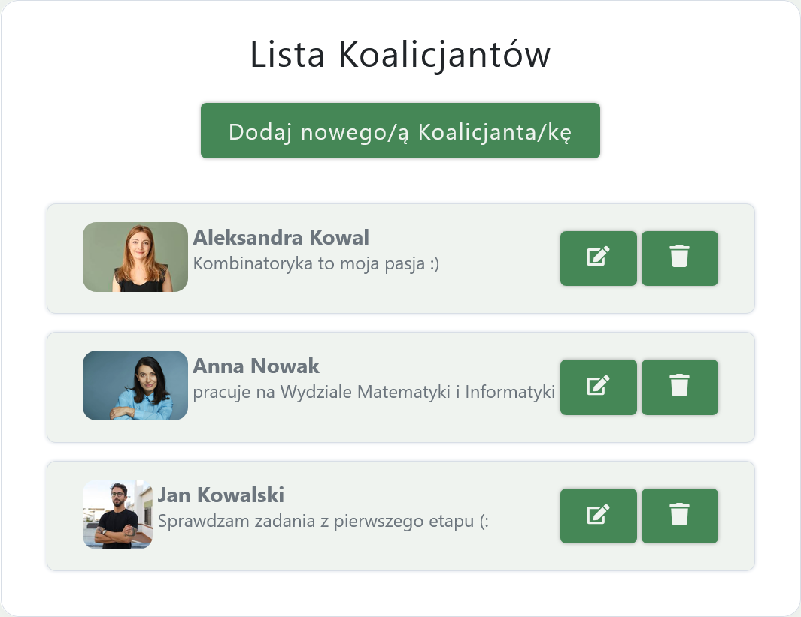

**_Przebieg:_**

1. Naciśnięcie przycisku „Dodaj nowego/ą koalicjanta/kę”.
2. Uzupełnienie wymaganych danych.
3. Naciśnięcie przycisku „Zapisz”.

**_Rezultat:_**

- Nowy koalicjant/ka zostaje zapisany/a w systemie.
- Koalicjant/ka pojawia się na liście koalicjantów.

**_Scenariusze alternatywne:_**

**A1. Nieuzupełnienie wymaganych pól**

1. Administrator pozostawia jedno lub więcej wymaganych pól pustych.
2. System wyświetla komunikaty walidacyjne.

_Rezultat:_ Koalicjant/ka nie zostaje utworzony/a.

---

### Cel : Edycja danych istniejącego koalicjanta w systemie

**_Warunki wstępne:_**

- Administrator jest zalogowany do systemu.
- Administrator posiada uprawnienia do zarządzania użytkownikami.
- Administrator znajduje się w zakładce Koalicjanci.
- Istnieje przynajmniej jeden koalicjant/ka.

**_Przebieg:_**

1. Naciśniecie przycisku edycji .
2. Zmiana danych w odpowiednich oknach tekstowych.
3. Naciśnięcie przycisku „Zapisz”.

**_Rezultat:_**

- Dane koalicjanta/ki zostają zmienione.

**_Scenariusze alternatywne:_**

**A1. Anulowanie operacji**

1. Administrator wybiera opcję „Anuluj”.

_Rezultat:_ Dane koalicjanta/ki zostają bez zmian.

**A2. Nieuzupełnienie wymaganych pól**

1. Administrator pozostawia jedno lub więcej wymaganych pól pustych.
2. System wyświetla komunikaty walidacyjne.

_Rezultat:_ Dane koalicjanta/ki zostają bez zmian.

---

### Cel : Usunięcie koalicjanta z systemu

**_Warunki wstępne:_**

- Administrator jest zalogowany do systemu.
- Administrator posiada uprawnienia do zarządzania użytkownikami.
- Administrator znajduje się w zakładce Koalicjanci.
- Istnieje przynajmniej jeden koalicjant/ka.

**_Przebieg:_**

1. Naciśniecie przycisku usunięcia .
2. Potwierdzenie ok w alercie.

**_Rezultat:_**

- Koalicjant/ka zostaje usunięty/a.

**_Scenariusze alternatywne:_**

**A1. Anulowanie usunięcia**

1. Administrator wybiera opcję „Anuluj” w oknie potwierdzenia.

_Rezultat:_ Koalicjant/ka pozostaje w systemie.

---

## Sponsorzy

### Cel : Dodanie nowego sponsora

**_Warunki wstępne:_**

- Administrator jest zalogowany do systemu.
- Administrator posiada uprawnienia do zarządzania użytkownikami.
- Administrator znajduje się w zakładce Sponsorzy.

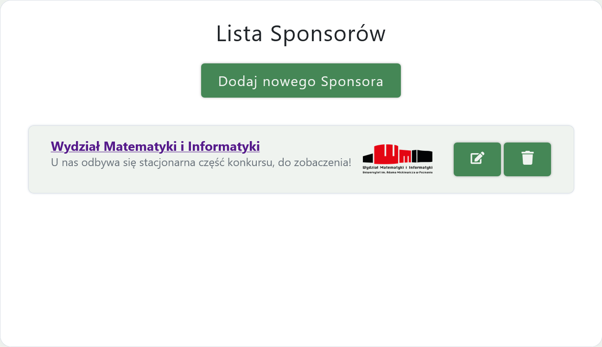

**_Przebieg:_**

1. Naciśnięcie przycisku „Dodaj nowego sponsora”.
2. Uzupełnienie wymaganych danych.
3. Naciśnięcie przycisku „Zapisz”.

**_Rezultat:_**

- Nowy sponsor zostaje zapisany w systemie.
- Sponsor pojawia się na liście sponsorów.

**_Scenariusze alternatywne:_**

**A1. Nieuzupełnienie wymaganych pól**

1. Administrator pozostawia jedno lub więcej wymaganych pól pustych.
2. System wyświetla komunikaty walidacyjne.

_Rezultat:_ Sponsor nie zostaje utworzony.

---

### Cel : Edycja danych istniejącego sponsora w systemie

**_Warunki wstępne:_**

- Administrator jest zalogowany do systemu.
- Administrator posiada uprawnienia do zarządzania użytkownikami.
- Administrator znajduje się w zakładce Sponsorzy.
- Istnieje przynajmniej jeden sponsor.

**_Przebieg:_**

1. Naciśniecie przycisku edycji .
2. Zmiana danych w odpowiednich oknach tekstowych.
3. Naciśnięcie przycisku „Zapisz”.

**_Rezultat:_**

- Dane sponsora zostają zmienione.

**_Scenariusze alternatywne:_**

**A1. Anulowanie operacji**

1. Administrator wybiera opcję „Anuluj”.

_Rezultat:_ Dane sponsora zostają bez zmian.

**A2. Nieuzupełnienie wymaganych pól**

1. Administrator pozostawia jedno lub więcej wymaganych pól pustych.
2. System wyświetla komunikaty walidacyjne.

_Rezultat:_ Dane sponsora zostają bez zmian.

---

### Cel : Usunięcie sponsora z systemu

**_Warunki wstępne:_**

- Administrator jest zalogowany do systemu.
- Administrator posiada uprawnienia do zarządzania użytkownikami.
- Administrator znajduje się w zakładce Sponsorzy.
- Istnieje przynajmniej jeden sponsor.

**_Przebieg:_**

1. Naciśniecie przycisku usunięcia .
2. Potwierdzenie ok w alercie.

**_Rezultat:_**

- Sponsor zostaje usunięty.

**_Scenariusze alternatywne:_**

**A1. Anulowanie usunięcia**

1. Administrator wybiera opcję „Anuluj” w oknie potwierdzenia.

_Rezultat:_ Sponsor pozostaje w systemie bez zmian.

---

## Historia i Regulamin

### Cel : Dodanie / Edycja pliku z historią

**_Warunki wstępne:_**

- Administrator jest zalogowany do systemu.
- Administrator posiada uprawnienia do zarządzania treścią.
- Administrator znajduje się w zakładce Historia.

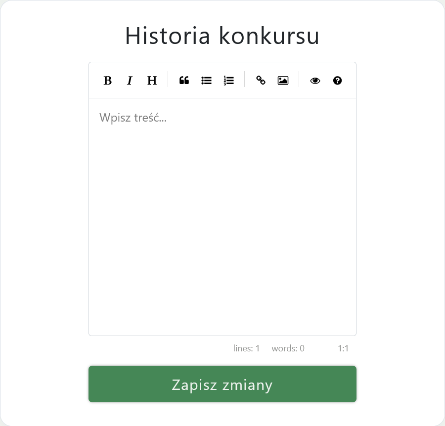

**_Przebieg:_**

1. Zmienienie załadowanych automatycznie danych z pliku histori przy pomocy markdown.
2. Naciśnięcie przycisku „Zapisz zmiany”.
3. Wyświetlenie alertu o pomyślnej zmianie pliku.

**_Rezultat:_**

- Historia zostaje zmieniona.

---

### Cel : Dodanie / Edycja pliku z regulaminem

**_Warunki wstępne:_**

- Administrator jest zalogowany do systemu.
- Administrator posiada uprawnienia do zarządzania treścią.
- Administrator znajduje się w zakładce Regulamin.

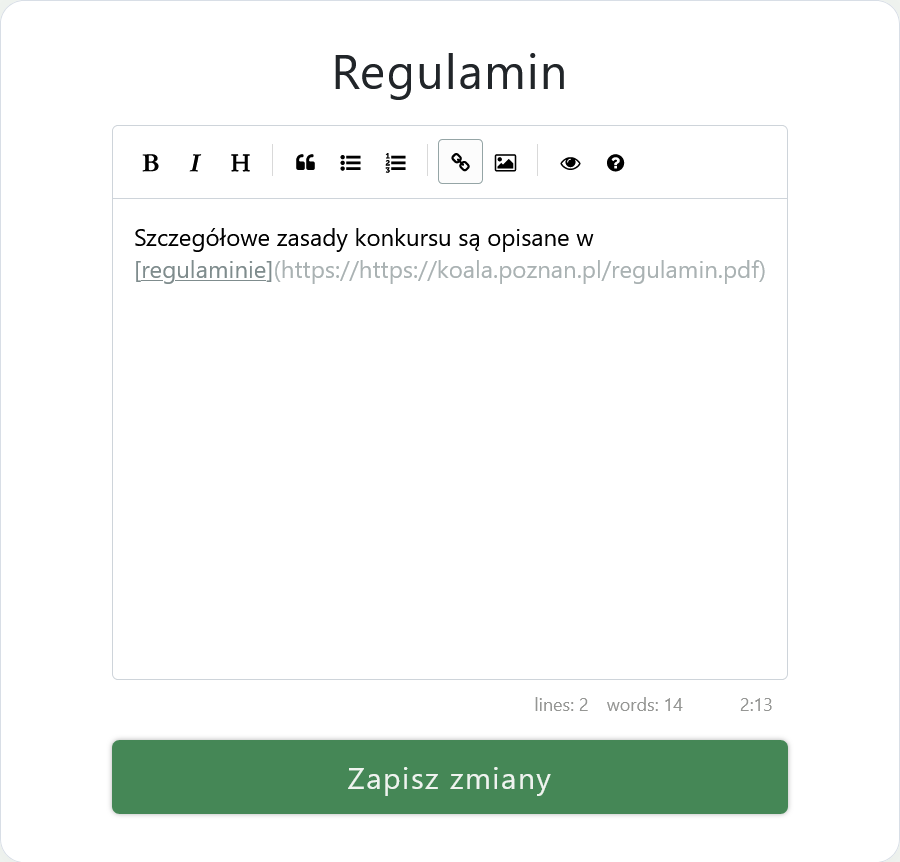

**_Przebieg:_**

1. Zmienienie załadowanych automatycznie danych z pliku regulaminu przy pomocy markdown.
2. Naciśnięcie przycisku „Zapisz zmiany”.
3. Wyświetlenie alertu o pomyślnej zmianie pliku.

**_Rezultat:_**

- Regulamin zostaje zmieniony.

---

## Edycje

### Cel : Dodanie nowej edycji

**_Warunki wstępne:_**

- Administrator jest zalogowany do systemu.
- Administrator posiada uprawnienia do zarządzania użytkownikami.
- Administrator znajduje się w zakładce edycji.

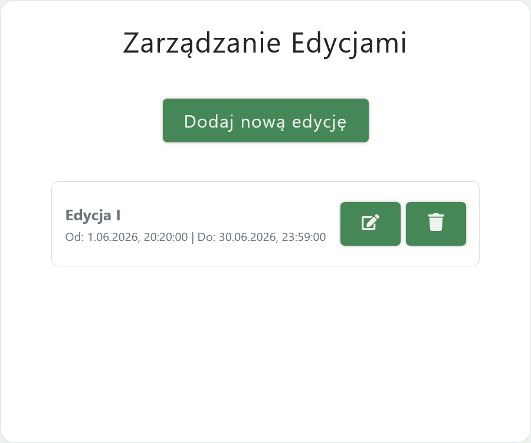

**_Przebieg:_**

1. Naciśnięcie przycisku „Dodaj nową edycję".
2. Uzupełnienie wymaganych danych.
3. Naciśnięcie przycisku „Zapisz edycję”.

**_Rezultat:_**

- Nowa edycja zostaje zapisana w systemie.
- Edycja pojawia się na liście edycji.

**_Scenariusze alternatywne:_**

**A1. Nieuzupełnienie wymaganych pól**

1. Administrator pozostawia jedno lub więcej wymaganych pól pustych.
2. System wyświetla komunikaty walidacyjne.

_Rezultat:_ Edycja nie zostaje utworzona.

---

### Cel : Edycja terminu / nazwy istniejącej edycji w systemie

**_Warunki wstępne:_**

- Administrator jest zalogowany do systemu.
- Administrator posiada uprawnienia do zarządzania użytkownikami.
- Administrator znajduje się w zakładce edycji.
- Istnieje przynajmniej jedna edycja.

**_Przebieg:_**

1. Naciśniecie przycisku edycji .
2. Zmiana danych w odpowiednich polach.
3. Naciśnięcie przycisku „Zapisz zmiany”.

**_Rezultat:_**

- Dane edycji zostają zmienione.

**_Scenariusze alternatywne:_**

**A1. Anulowanie operacji**

1. Administrator wybiera opcję „Anuluj”.

_Rezultat:_ Dane edycji zostają bez zmian.

**A2. Nieuzupełnienie wymaganych pól**

1. Administrator pozostawia jedno lub więcej wymaganych pól pustych.
2. System wyświetla komunikaty walidacyjne.

_Rezultat:_ Dane edycji zostają bez zmian.

---

### Cel : Usunięcie edycji z systemu

**_Warunki wstępne:_**

- Administrator jest zalogowany do systemu.
- Administrator posiada uprawnienia do zarządzania użytkownikami.
- Administrator znajduje się w zakładce edycji.
- Istnieje przynajmniej jedna edycja.

**_Przebieg:_**

1. Naciśniecie przycisku usunięcia .
2. Potwierdzenie ok w alercie.

**_Rezultat:_**

- Edycja zostaje usunięta.

**_Scenariusze alternatywne:_**

**A1. Anulowanie usunięcia**

1. Administrator wybiera opcję „Anuluj” w oknie potwierdzenia.

_Rezultat:_ Edycja pozostaje w systemie bez zmian.

---

## Pliki i wpisy

### Cel : Dodanie pliku / zdjęcia

**_Warunki wstępne:_**

- Administrator jest zalogowany do systemu.
- Administrator posiada uprawnienia do zarządzania użytkownikami.
- Administrator znajduje się w zakładce pliki.

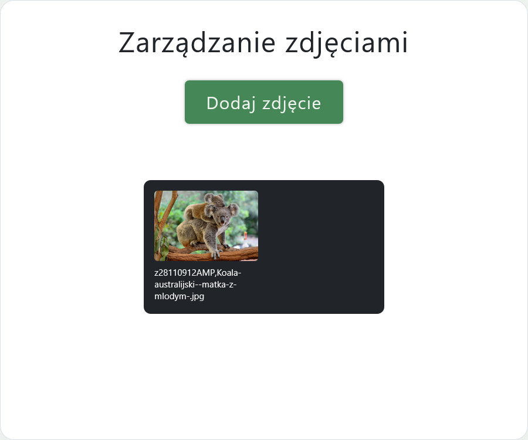

**_Przebieg:_**

1. Naciśnięcie przycisku „Dodaj zdjęcie”.
2. Wybierz zdjecie lub plik z własnego komputera w automatycznie otworzonym oknie.
3. Naciśnięcie przycisku „Otwórz”.

**_Rezultat:_**

- Zdjęcie zostaje zapisane w systemie.
- Zdjęcie pojawia się w zakładce oraz w innych miejscach umożliwiających dostęp do plików na stronie.

**_Scenariusze alternatywne:_**

**A1. Wybranie pliku w nieobsługiwanym formacie**

1. System wyświetla komunikaty walidacyjne.

_Rezultat:_ Zdjęcie nie zostaje dodane.

---

### Cel : Usunięcie pliku / zdjęcia

**_Warunki wstępne:_**

- Administrator jest zalogowany do systemu.
- Administrator posiada uprawnienia do zarządzania użytkownikami.
- Administrator znajduje się w zakładce pliki.

**_Przebieg:_**

1. Naciśnięcie zdjęcia, wybranego do usunięcia.
2. Potwierdzenie ok w alercie.

**_Rezultat:_**

- Zdjęcie zostaje usunięte.

**_Scenariusze alternatywne:_**

**A1. Anulowanie usunięcia**

1. Administrator wybiera opcję „Anuluj” w oknie potwierdzenia.

_Rezultat:_ Zdjęcie pozostaje w systemie.

---

### Cel : Dodanie wpisu

**_Warunki wstępne:_**

- Administrator jest zalogowany do systemu.
- Administrator posiada uprawnienia do zarządzania użytkownikami.
- Administrator znajduje się w zakładce Wpisy.
- Istnieje przynajmniej jedna aktywna edycja.

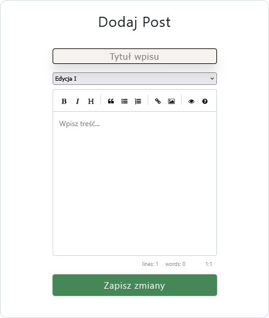

**_Przebieg:_**

1. Uzupełnienie wymaganych danych, w tym wybranie odpowiedniej edycji w rozwijanym polu pod tytułem.
2. W razie potrzeby naciśnięcie ikony zdjęcia , a następnie wybranie przesłanego wcześniej zdjęcia.
3. Naciśnięcie przycisku „Zapisz zmiany”.

**_Rezultat:_**

- Nowy wpis zostaje zapisany w systemie.
- Wpis pojawia się na liście wpisów oraz na publicznej stronie z aktualnościami.

**_Scenariusze alternatywne:_**

**A1. Nieuzupełnienie wymaganych pól**

1. Administrator pozostawia jedno lub więcej wymaganych pól pustych.
2. System wyświetla komunikaty walidacyjne.

_Rezultat:_ Wpis nie zostaje utworzony.

---

### Cel : Edycja wpisu

**_Warunki wstępne:_**

- Administrator jest zalogowany do systemu.
- Administrator posiada uprawnienia do zarządzania użytkownikami.
- Administrator znajduje się w zakładce Wpisy.
- Istnieje przynajmniej jedna edycja.
- Istnieje przynajmniej jeden wpis.

**_Przebieg:_**

1. Naciśniecie przycisku edycji .
2. W miejscu dodawania wpisów pojawiają się dane edytowanego wpisu.
3. Zmiana danych w odpowiednich oknach tekstowych.
4. Naciśnięcie przycisku „Zapisz zmiany”.

**_Rezultat:_**

- Dane wpisu zostają zmienione.

**_Scenariusze alternatywne:_**

**A1. Anulowanie operacji**

1. Administrator ponownie naciska przycisk edycji .

_Rezultat:_ Dane wpisu zostają bez zmian.

**A2. Nieuzupełnienie wymaganych pól**

1. Administrator pozostawia jedno lub więcej wymaganych pól pustych.
2. System wyświetla komunikaty walidacyjne.

_Rezultat:_ Dane wpisu zostają bez zmian.

---

### Cel : Usunięcie wpisu

**_Warunki wstępne:_**

- Administrator jest zalogowany do systemu.
- Administrator posiada uprawnienia do zarządzania użytkownikami.
- Administrator znajduje się w zakładce Wpisy.
- Istnieje przynajmniej jedna edycja.
- Istnieje przynajmniej jeden wpis.

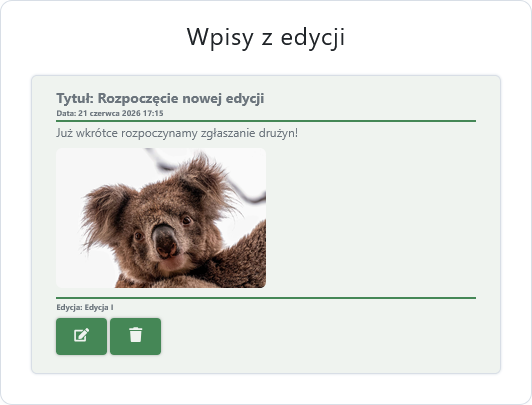

**_Przebieg:_**

1. Naciśniecie przycisku usunięcia .
2. Potwierdzenie ok w alercie.

**_Rezultat:_**

- Wpis zostaje usunięty.

**_Scenariusze alternatywne:_**

**A1. Anulowanie usunięcia**

1. Administrator wybiera opcję „Anuluj” w oknie potwierdzenia.

_Rezultat:_ Wpis pozostaje w systemie.

---

## Zadania

### Cel : Dodanie pliku z zadaniami

**_Warunki wstępne:_**

- Administrator jest zalogowany do systemu.
- Administrator posiada uprawnienia do zarządzania użytkownikami.
- Administrator znajduje się w zakładce Zadania.
- Istnieje przynajmniej jedna aktywna edycja.

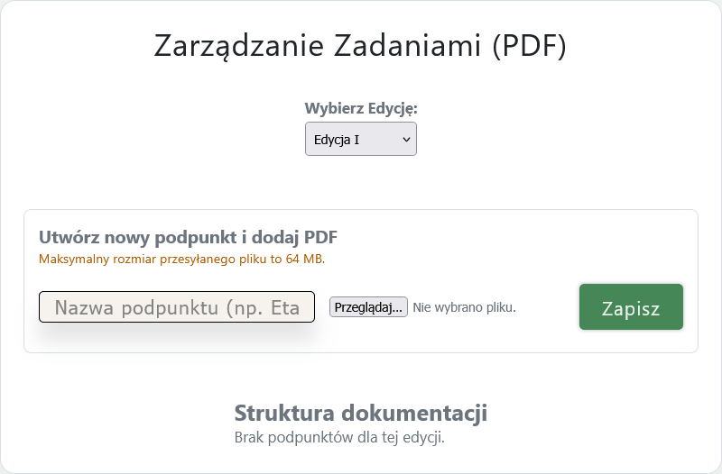

**_Przebieg:_**

1. Wybieranie z rozwijanego pola odpowiedniej edycji.
2. Uzupełnienie wymaganych danych.
3. Wybieranie z własnego urządzenia pliku z zadaniami, poprzez naciśniecie przycisku "Przeglądaj"
4. Naciśnięcie przycisku „Zapisz”.

**_Rezultat:_**

- Plik z zadaniami zostaje zapisany w systemie.
- Zadania pojawiają się na liście zadań oraz na odpowiadającej jej publicznej stronie z zadaniami dla uczestników konkursu.

**_Scenariusze alternatywne:_**

**A1. Nieuzupełnienie wymaganych pól**

1. Administrator pozostawia jedno lub więcej wymaganych pól pustych.
2. System wyświetla komunikaty walidacyjne.

_Rezultat:_ Zadania nie zostają dodane.

**A2. Wybranie pliku w nieobsługiwanym formacie**

1. System wyświetla komunikaty walidacyjne.

_Rezultat:_ Zadania nie zostają dodane.

---

### Cel : Usunięcie pliku z zadaniami

**_Warunki wstępne:_**

- Administrator jest zalogowany do systemu.
- Administrator posiada uprawnienia do zarządzania użytkownikami.
- Administrator znajduje się w zakładce Zadania.
- Istnieje przynajmniej jedna edycja.
- Istnieje przynajmniej jeden plik z zadaniami w systemie.

**_Przebieg:_**

1. Naciśniecie przycisku usunięcia .
2. Potwierdzenie ok w alercie.

**_Rezultat:_**

- Plik z zadaniami zostaje usunięty.

**_Scenariusze alternatywne:_**

**A1. Anulowanie usunięcia**

1. Administrator wybiera opcję „Anuluj” w oknie potwierdzenia.

_Rezultat:_ Plik z zadaniami pozostaje w systemie.

---

## Szkoły

### Cel : Zaimportowanie odpowiedznich szkół i placówek oświatowych z strony https://rspo.gov.pl/zaawansowana

**_Warunki wstępne:_**

- Administrator jest zalogowany do systemu.
- Administrator posiada uprawnienia do zarządzania użytkownikami.
- Administrator znajduje się w zakładce Szkoły.

import szkoly

**_Przebieg:_**

1. Administrator przechodzi do strony [Rejestru szkół i placówek oświatowych](https://rspo.gov.pl/zaawansowana).
2. Naciska przycisk „Wyświetl dodatkowe pola wyszukiwania”.

3. W formularzu importu określa kryteria wyszukiwania szkół (np. województwo, powiat, gmina lub typ placówki).
    - Otworzy się strona z 9 obszarami jednak ważne dla pobrania szkół są tylko dwa.
    - Zaznaczamy województwo Wielkopolskie.
      
    - Zaznaczamy typ szkoły podstawowe oraz ponadpodstawowe (strona automatycznie załączy np szkoły muzyczne, technika itp.).
      
    - Naciskamy przycisk "Szukaj" znajdujący się na samym dole strony.
      

4. System RSPO przekieruje użytkownika na stronę z wynikami wyszukiwania.

5. Naciska przycisk „Pobierz plik CSV z wynikami”.
6. Plik pobiera się na lokalne urządzenie użytkownika.
7. Przejście na stronę Koali do zakładki Szkoły.

8. Nacisnąć przycisk "Przeglądaj" oraz wybierz odpowiedni plik z lokalnego urządzenia.
9. Nacisnąć przycisk "Importuj"
10. System zapisuje zaimportowane szkoły w bazie danych.

**_Rezultat:_**

- Wybrane szkoły i placówki oświatowe zostają dodane do systemu.
- Zaimportowane rekordy są widoczne na liście szkół.
- Szkoła pojawia się na liście szkół w panelu kapitana przy tworzeniu drużyny.

**_Scenariusze alternatywne:_**

**A1. Próba ponownego importu istniejących szkół**

1. Administrator importuje szkoły, które znajdują się już w systemie.
2. System wykrywa duplikaty.

_Rezultat:_ Istniejące szkoły nie są dodawane ponownie.

---

### Cel : Wyszukanie konkretnej szkoły

**_Warunki wstępne:_**

- Administrator jest zalogowany do systemu.
- Administrator posiada uprawnienia do zarządzania użytkownikami.
- Administrator znajduje się w zakładce Szkoły.
- Istnieje przynajmniej jedna szkoła.

**_Przebieg:_**

1. W polu wyszukiwania wpisuje nazwę, RSPO, adres lub inną wartość identyfikującą szkołę.
2. System automatycznie filtruje listę szkół.

**_Rezultat:_**

- Na liście wyświetlane są wyłącznie szkoły spełniające podane kryteria wyszukiwania.
- Administrator może przejść do edycji wybranej szkoły.

**_Scenariusze alternatywne:_**

**A1. Brak wyników wyszukiwania**

1. Administrator wprowadza frazę, dla której nie istnieją pasujące szkoły.
2. System nie znajduje żadnych wyników.

_Rezultat:_ Wyświetlany jest komunikat „Brak zespołów spełniających kryteria wyszukiwania.”.

---

### Cel : Dodanie szkoły ręcznie

**_Warunki wstępne:_**

- Administrator jest zalogowany do systemu.
- Administrator posiada uprawnienia do zarządzania użytkownikami.
- Administrator znajduje się w zakładce Szkoły.

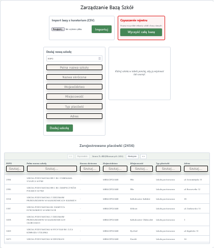

**_Przebieg:_**

1. Uzupełnienie wymaganych danych w okienku "Dodaj nową szkołę".
2. Naciśnięcie przycisku „Dodaj szkołą”.

**_Rezultat:_**

- Nowa szkołą zostaje zapisana w systemie.
- Szkoła pojawia się na liście szkół zarówno u administratorów jak w panelu kapitana przy tworzeniu drużyny.

**_Scenariusze alternatywne:_**

**A1. Nieuzupełnienie wymaganych pól**

1. Administrator pozostawia jedno lub więcej wymaganych pól pustych.
2. System wyświetla komunikaty walidacyjne.

_Rezultat:_ Szkoła nie zostaje dodana.

**A2. Próba dodania istniejącej szkoły**

1. Administrator uzupełnia wymagane pola.
2. Wpisana szkoła już istnieje w systemie.
3. System wyświetla komunikat i nie wykonuje operacji.

_Rezultat:_ Szkoła nie zostaje dodana.

---

### Cel : Edycja danych wybranej szkoły

**_Warunki wstępne:_**

- Administrator jest zalogowany do systemu.
- Administrator posiada uprawnienia do zarządzania użytkownikami.
- Administrator znajduje się w zakładce Szkoły.
- Istnieje przynajmniej jedna szkoła.

**_Przebieg:_**

1. Naciśniecie w dowolnym miejscu wiersza z wybraną szkołą.
2. Zmiana danych w odpowiednich oknach tekstowych.
3. Naciśnięcie przycisku „Zapisz zmiany”.

**_Rezultat:_**

- Dane szkoły zostają zmienione.

**_Scenariusze alternatywne:_**

**A1. Anulowanie operacji**

1. Administrator wybiera inną szkołę.

_Rezultat:_ Dane szkoły zostają bez zmian.

**A2. Nieuzupełnienie wymaganych pól**

1. Administrator pozostawia jedno lub więcej wymaganych pól pustych.
2. System wyświetla komunikaty walidacyjne.

_Rezultat:_ Dane szkoły zostają bez zmian.

---

### Cel : Usunięcie wybranej szkoły

**_Warunki wstępne:_**

- Administrator jest zalogowany do systemu.
- Administrator posiada uprawnienia do zarządzania użytkownikami.
- Administrator znajduje się w zakładce Szkoły.
- Istnieje przynajmniej jedna szkoła.

**_Przebieg:_**

1. Naciśniecie w dowolnym miejscu wiersza z wybraną szkołą.
2. Naciśnięcie przycisku „Usuń szkołę”.

3. Potwierdzenie ok w alercie

**_Rezultat:_**

- Szkoła została usunięta z systemu.

**_Scenariusze alternatywne:_**

**A1. Anulowanie usunięcia**

1. Administrator wybiera opcję „Anuluj” w oknie potwierdzenia.

_Rezultat:_ Dane szkoły zostają bez zmian.

---

### Cel : Wyczyszczenie całego rejestru szkół

**_Warunki wstępne:_**

- Administrator jest zalogowany do systemu.
- Administrator posiada uprawnienia do zarządzania użytkownikami.
- Administrator znajduje się w zakładce Szkoły.
- Istnieje przynajmniej jedna szkoła.

**_Przebieg:_**

1. Naciśniecie przycisku "Wyczyść całą bazę".

2. Potwierdzenie ok w alercie.

**_Rezultat:_**

- Baza szkół zostaje całkowicie wyczyszczona.

**_Scenariusze alternatywne:_**

**A1. Anulowanie usunięcia**

1. Administrator wybiera opcję „Anuluj” w oknie potwierdzenia.

_Rezultat:_ Baza szkół pozostaje w systemie.

---

## Drużyny

### Cel : Wyszukanie konkretnego zespołu

**_Warunki wstępne:_**

- Administrator jest zalogowany do systemu.
- Administrator posiada uprawnienia do zarządzania użytkownikami.
- Administrator znajduje się w zakładce drużyny.
- Istnieje przynajmniej jedna drużyna.

**_Przebieg:_**

1. W polu wyszukiwania wpisuje nazwę drużyny, RSPO szkoły lub inną wartość identyfikującą zespół.
2. System automatycznie filtruje listę drużyn.

**_Rezultat:_**

- Na liście wyświetlane są wyłącznie drużyny spełniające podane kryteria wyszukiwania.
- Administrator może przejść do edycji wybranej drużyny.

**_Scenariusze alternatywne:_**

**A1. Brak wyników wyszukiwania**

1. Administrator wprowadza frazę, dla której nie istnieją pasujące drużyny.
2. System nie znajduje żadnych wyników.

_Rezultat:_ Wyświetlany jest komunikat „Brak zespołów spełniających kryteria wyszukiwania.”.

---

### Cel : Edycja danych drużyny

**_Warunki wstępne:_**

- Administrator jest zalogowany do systemu.
- Administrator posiada uprawnienia do zarządzania użytkownikami.
- Administrator znajduje się w zakładce drużyny.
- Istnieje przynajmniej jedna drużyna.

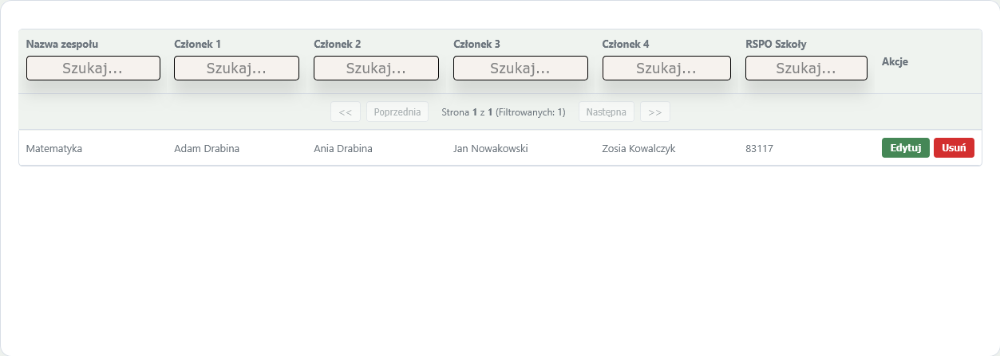

**_Przebieg:_**

1. Naciśniecie przycisku "Edytuj".
2. Zmiana danych w odpowiednich oknach tekstowych.
3. Naciśnięcie przycisku „Zapisz”.

**_Rezultat:_**

- Dane drużyny zostają zmienione.

**_Scenariusze alternatywne:_**

**A1. Anulowanie operacji**

1. Administrator naciska przycisk "Anuluj".

_Rezultat:_ Dane drużyny zostają bez zmian.

**A2. Nieuzupełnienie wymaganych pól**

1. Administrator pozostawia jedno lub więcej wymaganych pól pustych.
2. System wyświetla komunikaty walidacyjne.

_Rezultat:_ Dane drużyny zostają bez zmian.

---

### Cel : Usunięcie drużyny

**_Warunki wstępne:_**

- Administrator jest zalogowany do systemu.
- Administrator posiada uprawnienia do zarządzania użytkownikami.
- Administrator znajduje się w zakładce drużyny.
- Istnieje przynajmniej jedna drużyna.

**_Przebieg:_**

1. Naciśniecie przycisku "Usuń".
2. Potwierdzenie ok w alercie.

**_Rezultat:_**

- Drużyna zostaje usunięta.

**_Scenariusze alternatywne:_**

**A1. Anulowanie usunięcia**

1. Administrator wybiera opcję „Anuluj” w oknie potwierdzenia.

_Rezultat:_ Drużyna pozostaje w systemie.

---

# Ostatnie 2 ścieżki przedstawia szczegółowe instrukcje obsługi panelu Kapitana grupy.

## Rejestracja, logowanie, wylogowanie i edycja hasła

### Cel : Zarejestrowanie siebie jako kapitana

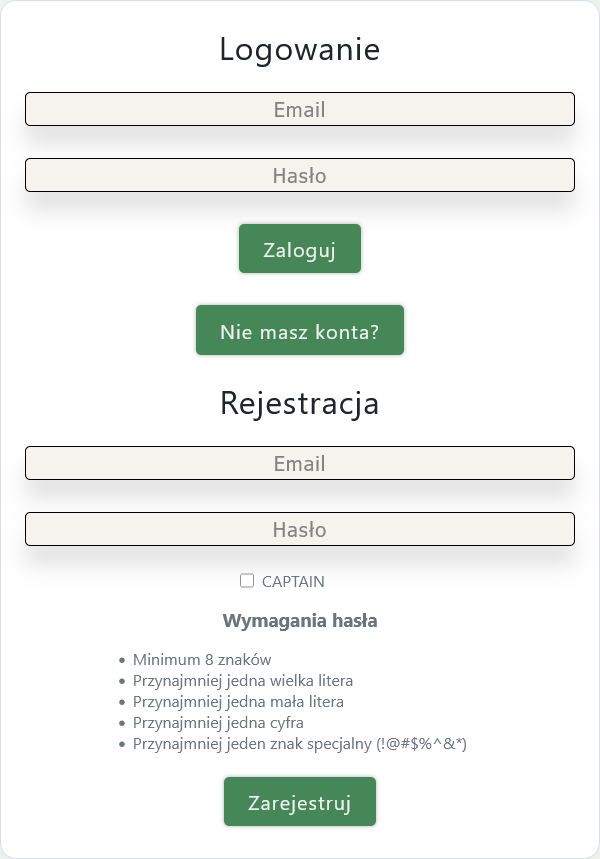

**_Warunki wstępne:_**

- Użytkownik znajduje się na stronie rejestracji uczestnika konkursu.
- Użytkownik nie posiada jeszcze konta w systemie.

**_Przebieg:_**

1. Użytkownik przechodzi do formularza rejestracyjnego.
2. Uzupełnia wymagane pola.
3. Naciska przycisk „Zarejestruj”.
4. System wyświetla komunikat potwierdzający utworzenie konta.

**_Rezultat:_**

- Konto kapitana zostaje utworzone w systemie.
- Użytkownik może zalogować się do panelu kapitana.

**_Scenariusze alternatywne:_**

**A1. Adres e-mail jest już zajęty**

1. Użytkownik podaje adres e-mail przypisany do istniejącego konta.
2. Użytkownik naciska przycisk „Zarejestruj”.
3. System wyświetla komunikat informujący o zajętym adresie e-mail.

_Rezultat:_ Konto nie zostaje utworzone.

**A2. Nieuzupełnienie wymaganych pól**

1. Użytkownik pozostawia jedno lub więcej wymaganych pól pustych.
2. Użytkownik naciska przycisk „Zarejestruj”.
3. System wyświetla komunikaty walidacyjne.

_Rezultat:_ Formularz nie zostaje wysłany.

---

### Cel : Zalogowanie siebie jako użytkownika

**_Warunki wstępne:_**

- Użytkownik znajduje się na stronie logowania panelu konkursu (/login).

**_Przebieg:_**

1. Uzupełnienie prawidłowymi danymi pól opisanych "Email" oraz "Hasło".
2. Naciśnięcie przycisku "Zaloguj".

**_Rezultat:_** Przekierowanie zalogowanego użytkownika na stronę aktualności (/).

**_Scenariusze alternatywne:_**

**A1. Nieprawidłowy adres e-mail lub hasło**

1. Użytkownik wprowadza nieprawidłowy adres e-mail lub hasło.
2. Użytkownik naciska przycisk „Zaloguj”.
3. System wyświetla komunikat o błędnych danych logowania.
4. Użytkownik pozostaje na stronie logowania.

_Rezultat:_ Logowanie nie zostaje wykonane.

**A2. Niewypełnienie wymaganych pól**

1. Użytkownik pozostawia puste pole „Email” lub „Hasło”.
2. Użytkownik naciska przycisk „Zaloguj”.
3. System wyświetla komunikat walidacyjny informujący o konieczności uzupełnienia wymaganych pól.

_Rezultat:_ Formularz nie zostaje wysłany.

---

### Cel : Wylogowanie

**_Warunki wstępne:_**

- Użytkownik jest zalogowany do systemu.
- Użytkownik posiada aktywne konto.

**_Przebieg:_**

1. Wybranie ikony Koali w prawym górnym rogu.
2. Wybranie opcji „Logout”.

**_Rezultat:_**

- Sesja użytkownika zostaje zakończona.
- System przekierowuje użytkownika na stronę logowania.

---

### Cel : Zmiana hasła swojego użytkownika

**_Warunki wstępne:_**

- Użytkownik jest zalogowany do systemu.
- Użytkownik posiada aktywne konto.

**_Przebieg:_**

1. Wybranie ikony Koali w prawym górnym rogu.
2. Wybranie opcji „Zmień hasło”.
3. Wprowadzenie aktualnego hasła.
4. Wprowadzenie nowego hasła.
5. Naciśnięcie przycisku „Potwierdź zmianę hasła”.

**_Rezultat:_** Hasło użytkownika zostaje zmienione.

**_Scenariusze alternatywne:_**

**A1. Niepoprawne aktualne hasło**

1. Użytkownik podaje błędne aktualne hasło.
2. System wyświetla komunikat o błędnym haśle.

_Rezultat:_ Hasło nie zostaje zmienione.

---

## Drużyny

### Cel : Dodanie drużyny jako kapitan

**_Warunki wstępne:_**

- Użytkownik posiada odpowiednie uprawnienia.
- Użytkownik znajduje się w sekcji "Dla Kapitana".

**_Przebieg:_**

1. Uzupełnienie wymaganych pól.
2. Zapisanie formularza.
   

**_Rezultat:_** Drużyna zostaje dodana.

**_Scenariusze alternatywne:_**

**A1. Nieuzupełnienie wymaganych pól**

1. Użytkownik pozostawia jedno lub więcej wymaganych pól pustych.
2. Użytkownik naciska przycisk „Załóż zespół”.
3. System wyświetla komunikaty walidacyjne.

_Rezultat:_ Formularz nie zostaje wysłany.

---

### Cel : Edycja danych drużyny jako kapitan

**_Warunki wstępne:_**

- Użytkownik posiada odpowiednie uprawnienia.
- Użytkownik znajduje się w sekcji "Dla Kapitana".

**_Przebieg:_**

1. Użytkownik naciska przycisk "Edytuj dane"
2. Edycja pól.
3. Zapisanie formularza.

**_Rezultat:_** Dane drużyny zostają zedytowane.

**_Scenariusze alternatywne:_**

**A1. Nieuzupełnienie wymaganych pól**

1. Użytkownik pozostawia jedno lub więcej wymaganych pól pustych.
2. Użytkownik naciska przycisk „Zapisz zmiany”.
3. System wyświetla komunikaty walidacyjne.

_Rezultat:_ Formularz nie zostaje wysłany.

**A2. Rezygnacja z edycji zespołu**

1. Użytkownik naciska przycisk „Anuluj”.

_Rezultat:_ Formularz nie zostaje wysłany.

---

### Cel : Usunięcie drużyny jako kapitan

**_Warunki wstępne:_**

- Użytkownik posiada odpowiednie uprawnienia.
- Użytkownik znajduje się w sekcji "Dla Kapitana".

**_Przebieg:_**

1. Użytkownik naciska przycisk "Usuń zespół"
2. Potwierdzenie ok w alercie.

**_Rezultat:_** Drużyna zostaje usunięta.

**_Scenariusze alternatywne:_**

**A1. Rezygnacja z usunięcia zespołu**

1. Użytkownik naciska przycisk „Anuluj”.

_Rezultat:_ Formularz nie zostaje wysłany.
